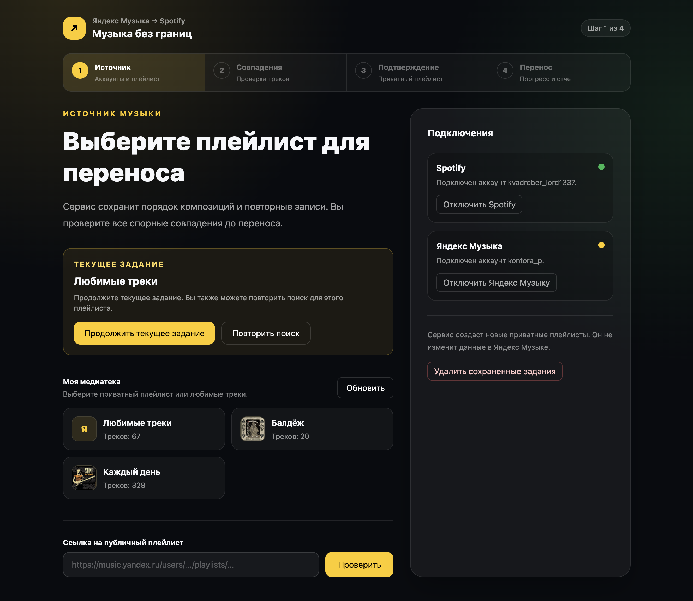

# Перенос плейлистов из Яндекс Музыки в Spotify

Сервис ищет треки из Яндекс Музыки в Spotify и создает новый приватный плейлист. Он сохраняет порядок треков и повторные записи. Сервис не копирует аудиофайлы и не изменяет плейлист в Яндекс Музыке.

## Локальный запуск

Для запуска нужен Node.js 22 или новее. Команда `npm start` работает в Windows, Linux и macOS.

1. [Создайте приложение Spotify](https://developer.spotify.com/documentation/web-api/concepts/apps). Откройте его настройки в [Spotify Developer Dashboard](https://developer.spotify.com/dashboard). В поле Redirect URIs добавьте `http://127.0.0.1:3000/api/auth/spotify/callback`. [Проверьте правила для адреса возврата](https://developer.spotify.com/documentation/web-api/concepts/redirect_uri).
2. Запустите `npm start`.
3. При первом запуске введите Client ID приложения Spotify.
4. Откройте `http://127.0.0.1:3000`.

Команда устанавливает зависимости, создает файл `.env` и записывает в него уникальный ключ. При повторном запуске она сохраняет существующие настройки. Для другого адреса возврата измените `NUXT_SPOTIFY_REDIRECT_URI` в `.env` и в приложении Spotify.

Не публикуйте файл `.env`. Не меняйте ключ после подключения аккаунтов: сервис использует его для чтения сохраненных токенов. Переменная `NUXT_ALLOWED_SPOTIFY_USERS` позволяет ограничить доступ списком идентификаторов Spotify через запятую. Если она пуста, сервис не применяет это ограничение.

## Запуск в Docker

Для этого способа нужны Docker и Node.js 22 или новее. Файл `compose.yaml` собирает образ для архитектуры вашего компьютера. Он сохраняет данные SQLite в томе `app-data`. Контейнер принимает соединения через `127.0.0.1:3000` хоста.

1. Создайте приложение Spotify с адресом возврата из раздела локального запуска.
2. Запустите `npm run setup`. При запросе введите Client ID приложения Spotify.
3. Запустите `docker compose up --build -d`.
4. Откройте `http://127.0.0.1:3000`.

Для другого адреса сервиса измените `NUXT_SPOTIFY_REDIRECT_URI`. Укажите тот же адрес возврата в приложении Spotify.

## Как пользоваться

1. Нажмите «Подключить Spotify». Разрешите доступ к аккаунту.
2. Выберите источник:
   - Для публичного плейлиста вставьте его ссылку. Нажмите «Проверить». Подключение Яндекс Музыки не требуется.
   - Для приватного плейлиста нажмите «Подключить Яндекс Музыку». Введите показанный код на странице Яндекса. Выберите плейлист или любимые треки.
3. Нажмите «Найти совпадения в Spotify». Дождитесь окончания поиска.
4. Проверьте треки с пометкой «Требует проверки». Нажмите «Подтвердить совпадение» для предложенного трека.
5. Для другого варианта нажмите «Подробнее». Выберите вариант Spotify. Нажмите «Подтвердить совпадение» в строке трека.
6. Для трека без подходящего варианта откройте «Подробнее». Используйте ручной поиск. Если подходящего варианта нет, нажмите «Не переносить этот трек».
7. Проверьте исключенные треки через фильтр «Не переносятся». Измените решение, если требуется.
8. Проверьте план переноса. Нажмите «Создать приватный плейлист».
9. После переноса откройте плейлист в Spotify. При необходимости скачайте отчет в формате JSON или CSV.

Если Spotify исчерпал квоту запросов, сервис продолжит поиск после восстановления квоты. Сервис сохраняет текущее задание. Кнопка «Повторить поиск» начинает поиск для этого плейлиста заново.
