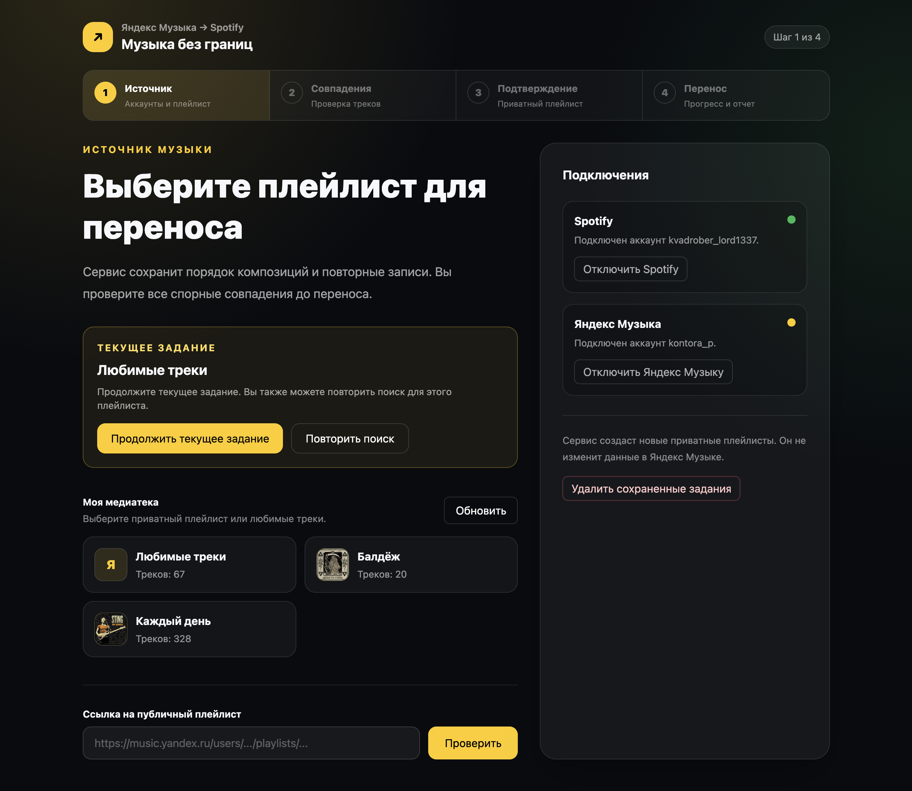

<p align="center">
  
</p>

<h1 align="center">Музыка без границ</h1>

<p align="center">
  <strong>Перенос плейлистов из Яндекс Музыки в Spotify</strong>
</p>

Сервис ищет треки из Яндекс Музыки в Spotify и создает новый приватный плейлист. Он сохраняет порядок треков и повторные записи. Сервис не копирует аудиофайлы и не изменяет плейлист в Яндекс Музыке.



## Способы запуска

Приложение можно запустить двумя способами:

| Способ | Как пользоваться |
| --- | --- |
| [Desktop](#desktop) | Установить приложение на компьютер и открыть его. |
| [Web](#web) | Запустить сервис с Node.js или Docker и открыть его в браузере. |

Оба способа поддерживают поиск совпадений, проверку треков и перенос плейлиста. Данные и подключенные аккаунты Desktop и Web хранятся отдельно.

## Desktop

Скачайте приложение, установите его и откройте YMusicToSpotify.

### 1. Скачайте и установите

Откройте [страницу загрузки](https://github.com/keyCat/yamusic-to-spotify/releases) и выберите файл для своего компьютера. Если установщиков там пока нет, Desktop-версия еще не опубликована.

| Ваш компьютер | Какой файл выбрать | Как установить |
| --- | --- | --- |
| Windows | Файл с окончанием `.exe` | Откройте файл и следуйте подсказкам установщика. |
| Windows без установки | Архив `.zip` | Распакуйте весь архив в отдельную папку. Откройте `YMusicToSpotify.exe` из этой папки. |
| Mac с чипом Apple | Файл с окончанием `mac-arm64.dmg` | Откройте файл и перетащите YMusicToSpotify в папку Applications («Программы»). |
| Mac с процессором Intel | Файл с окончанием `mac-x64.dmg` | Откройте файл и перетащите YMusicToSpotify в папку Applications («Программы»). |
| Linux | `.deb` для Ubuntu/Debian или `.AppImage` | Для `.deb` откройте файл и нажмите «Установить». Для `.AppImage` разрешите запуск в свойствах файла, затем откройте его. |
| Linux без установки | Архив `.tar.gz` | Распакуйте архив и откройте `music-without-borders` внутри полученной папки. |

Для версий без установки сохраняйте всю распакованную папку: приложение использует файлы рядом с исполняемым файлом. Устанавливать Node.js отдельно не нужно. Настройки и аккаунты сохраняются на компьютере в [папке профиля](#данные-desktop-и-резервное-копирование).

Чтобы узнать, какой у вас Mac, нажмите ** → Об этом Mac**. Посмотрите строку «Чип» или «Процессор»: там будет Apple или Intel. Приложению нужна macOS 13 или новее.

После установки откройте **YMusicToSpotify**. Если Mac не разрешает запуск, воспользуйтесь [инструкцией ниже](#macos-приложение-не-открывается).

### 2. Подключите Spotify

При первом запуске приложение попросит **Client ID** — код, который нужно получить на сайте Spotify. Эта настройка делается один раз. Для нее нужна подписка **Spotify Premium**: это [требование Spotify](https://developer.spotify.com/documentation/web-api/concepts/quota-modes#development-mode).

1. Откройте [страницу настройки Spotify](https://developer.spotify.com/dashboard) и войдите в свой аккаунт.
2. Нажмите **Create app** («Создать приложение»). Укажите любое название и описание, например «Перенос музыки».
3. В поле **Redirect URI** вставьте этот адрес целиком: `http://127.0.0.1/api/auth/spotify/callback`.
4. Выберите **Web API**, примите условия Spotify и сохраните.
5. Откройте **Settings → Users Management → Add new user**. Добавьте свое имя и адрес электронной почты, с которым вы зарегистрированы в Spotify.
6. В **Settings** скопируйте значение **Client ID**. Вернитесь в YMusicToSpotify и вставьте его в такое же поле на шаге «Настройки».
7. Нажмите **«Сохранить и продолжить»**, затем **«Подключить Spotify»**. В открывшемся браузере разрешите доступ и вернитесь в приложение.

Теперь выберите плейлист из Яндекс Музыки и следуйте подсказкам. Подробные шаги — в разделе [«Как пользоваться»](#как-пользоваться).

Настройки сохраняются. При следующем запуске нажмите **«Продолжить»**, чтобы перейти к выбору плейлиста.

### macOS: приложение не открывается

Apple пока не проверяла эту версию приложения, поэтому Mac может заблокировать первый запуск. Разрешите его вручную:

1. Откройте YMusicToSpotify из папки **«Программы»**. Если появилось предупреждение, закройте его, оставив приложение на компьютере.
2. Откройте **Системные настройки → Конфиденциальность и безопасность**.
3. Прокрутите вниз и нажмите **«Все равно открыть» (Open Anyway)** рядом с сообщением о YMusicToSpotify.
4. Подтвердите действие паролем или Touch ID, если потребуется, затем нажмите **«Открыть»**.

В дальнейшем приложение можно открывать обычным способом. [Инструкция Apple](https://support.apple.com/ru-ru/102445).

<details>
<summary>Если «Все равно открыть» не помогло</summary>

Попробуйте этот способ только для приложения, скачанного со страницы этого проекта. Если Mac сообщает, что обнаружено вредоносное ПО, не продолжайте.

1. Убедитесь, что YMusicToSpotify находится в папке **«Программы»**.
2. Нажмите **⌘ + пробел**, введите **Терминал** и нажмите Enter.
3. Скопируйте в открывшееся окно эту команду и нажмите Enter:

   ```sh
   xattr -dr com.apple.quarantine "/Applications/YMusicToSpotify.app"
   ```

4. Снова откройте YMusicToSpotify из папки «Программы».

Если проблема осталась, [сообщите о ней](https://github.com/keyCat/yamusic-to-spotify/issues), приложив текст ошибки.

</details>

### Обновление приложения

Для обновления скачайте новую версию и установите ее вместо старой. Ваши настройки и подключенные аккаунты сохранятся.

## Web

Web-версия запускается как локальный сервис и открывается в браузере по адресу `http://127.0.0.1:3000`. Выберите запуск с Node.js или в Docker. В обоих вариантах настройки берутся из `.env`; интерфейс содержит четыре шага: Источник → Совпадения → Подтверждение → Перенос.

### Локально с Node.js

1. Установите [Node.js с официального сайта](https://nodejs.org/en/download). Выберите версию LTS не ниже 22 с npm. Отдельно устанавливать npm не нужно.
2. Откройте [страницу проекта](https://github.com/keyCat/yamusic-to-spotify). Нажмите Code → Download ZIP. Распакуйте скачанный архив.
3. [Создайте приложение Spotify](https://developer.spotify.com/documentation/web-api/concepts/apps). Откройте его настройки в [Spotify Developer Dashboard](https://developer.spotify.com/dashboard). В поле Redirect URIs добавьте `http://127.0.0.1:3000/api/auth/spotify/callback`. [Проверьте правила для адреса возврата](https://developer.spotify.com/documentation/web-api/concepts/redirect_uri).
4. Откройте командную строку в папке проекта:
   - **Windows:** откройте папку проекта в Проводнике. Нажмите на адресную строку, введите `cmd` и нажмите Enter.
   - **macOS и Linux:** откройте терминал в папке проекта.
5. В открывшемся окне введите `npm start` и нажмите Enter.
6. При первом запуске введите Client ID приложения Spotify.
7. Откройте `http://127.0.0.1:3000` в браузере.

Не закрывайте окно командной строки во время работы с приложением. Чтобы остановить приложение, нажмите Ctrl+C в этом окне.

Команда устанавливает зависимости, создает файл `.env` и записывает в него уникальный ключ. При повторном запуске она сохраняет существующие настройки. Для другого адреса возврата измените `NUXT_SPOTIFY_REDIRECT_URI` в `.env` и в приложении Spotify.

Не публикуйте файл `.env`. Не меняйте ключ после подключения аккаунтов: сервис использует его для чтения сохраненных токенов. Переменная `NUXT_ALLOWED_SPOTIFY_USERS` позволяет ограничить доступ списком идентификаторов Spotify через запятую. Если она пуста, сервис не применяет это ограничение.

### В Docker

Для этого способа нужны Docker и Node.js 22 или новее. Файл `compose.yaml` собирает образ для архитектуры вашего компьютера. Он сохраняет данные SQLite в томе `app-data`. Контейнер принимает соединения через `127.0.0.1:3000` хоста.

1. Скачайте исходники проекта и создайте приложение Spotify с адресом возврата `http://127.0.0.1:3000/api/auth/spotify/callback`, как описано в разделе «Локально с Node.js».
2. Откройте командную строку в папке проекта, как описано выше. Введите `npm run setup`. При запросе введите Client ID приложения Spotify.
3. Запустите `docker compose up --build -d`.
4. Откройте `http://127.0.0.1:3000`.

Для другого адреса сервиса измените `NUXT_SPOTIFY_REDIRECT_URI`. Укажите тот же адрес возврата в приложении Spotify.

## Как пользоваться

1. Нажмите «Подключить Spotify». Разрешите доступ к аккаунту.
2. Выберите источник:
   - Для публичного плейлиста вставьте его ссылку. Нажмите «Проверить». Подключение Яндекс Музыки не требуется.
   - Для приватного плейлиста нажмите «Подключить Яндекс Музыку». Введите показанный код на странице Яндекса. Выберите плейлист или любимые треки.
3. Нажмите «Найти совпадения в Spotify». Дождитесь окончания поиска.
4. Проверьте треки с пометкой «Требует проверки». Нажмите «Подтвердить совпадение» для предложенного трека.
5. Для другого варианта нажмите «Подробнее». Выберите вариант Spotify. Нажмите «Подтвердить совпадение» в строке трека.
6. Для трека без подходящего варианта откройте «Подробнее». Используйте ручной поиск. Если подходящего варианта нет, нажмите «Не переносить этот трек».
7. Проверьте исключенные треки через фильтр «Не переносятся». Измените решение, если требуется.
8. Проверьте план переноса. Нажмите «Создать приватный плейлист».
9. После переноса откройте плейлист в Spotify. При необходимости скачайте отчет в формате JSON или CSV.

Если Spotify исчерпал квоту запросов, сервис продолжит поиск после восстановления квоты. Сервис сохраняет текущее задание. Кнопка «Повторить поиск» начинает поиск для этого плейлиста заново.

## Сборка Desktop из исходников

Используйте Node.js 24 с npm и собирайте каждую платформу на ее родной ОС. Для Linux DEB нужен `dpkg`; smoke-проверке без рабочего стола нужен Xvfb.

Исходная иконка приложения — [build/icon-gradient.png](build/icon-gradient.png). Она используется в заголовке README; из нее подготовлены иконки Desktop и favicon Web. После замены исходной картинки выполните `npm run icons:generate` на macOS с установленным ImageMagick, затем сохраните обновленные файлы из `build/` и `public/` в Git. Для обычной сборки конвертация иконок не нужна.

```sh
npm ci
npm run desktop:dev      # сборка и запуск приложения
```

На macOS эта команда также готовит локальную `.app`-сборку в `.desktop/dev/`, чтобы в Dock и меню отображались имя YMusicToSpotify и иконка приложения. Установщик не создается.

Для установщика и проверки подготовленной сборки:

```sh
npm run desktop:build
npm run desktop:package
npm run desktop:smoke -- --packaged
node scripts/check-desktop-artifacts.mjs
```

Артефакты, размеры и SHA-256 находятся в `release/`. В Linux запускайте smoke-команду через `xvfb-run -a`, если графическая сессия отсутствует. Сохраняйте Chromium sandbox; не добавляйте `--no-sandbox`. Если политика AppArmor запрещает user namespaces, используйте разрешенную среду CI или системную политику для приложения.

По умолчанию ресурсы SQLite готовятся для текущей ОС и архитектуры. Для другой архитектуры задайте `DESKTOP_TARGET_PLATFORM` (`darwin`, `win32`, `linux`) и `DESKTOP_TARGET_ARCH` (`arm64`, `x64`) перед `desktop:build`, затем передайте тот же `--arm64` или `--x64` команде `desktop:package`. Проверка перед упаковкой отклоняет несовпадающие ресурсы.

Скрипт desktop-сборки использует пустой dotenv-файл и удаляет унаследованные `NUXT_*`/`NITRO_*` параметры сборки. Рабочий desktop-сервер получает настройки только от Electron. Локальный запуск и Docker используют настройки `.env`, как описано в разделе [Web](#web).

Workflow [.github/workflows/desktop-build.yml](.github/workflows/desktop-build.yml) запускается только при отправке тега версии `v*` или вручную. Он собирает четыре варианта и проверяет упакованные приложения. Windows ZIP и Linux tar.gz дополнительно распаковываются и проверяются запуском приложения. После успеха всех сборок публикуется GitHub Release с пятью установщиками и двумя архивами без установки, отдельными файлами `.sha256`, общим `SHA256SUMS` и размерами файлов. Все семь файлов также сохраняются как CI artifacts.

Для подписи добавьте secrets `DESKTOP_CSC_LINK`/`DESKTOP_CSC_KEY_PASSWORD` (macOS), `DESKTOP_WIN_CSC_LINK`/`DESKTOP_WIN_CSC_KEY_PASSWORD` (Windows), а для notarization — `DESKTOP_APPLE_ID`, `DESKTOP_APPLE_APP_SPECIFIC_PASSWORD`, `DESKTOP_APPLE_TEAM_ID`. В отсутствие этих значений создаются сборки без подписи.

### Выпуск новой версии

Тег должен совпадать с версией в `package.json` и `package-lock.json`: например, `v1.0.0` для версии `1.0.0`. Обновляйте версию командой `npm version`, чтобы оба файла оставались согласованными. Workflow и изменения приложения должны находиться в коммите, отмеченном тегом.

Для первого выпуска версии `1.0.0`, после сохранения изменений в Git:

```sh
git tag v1.0.0
git push origin v1.0.0
```

Для ручного запуска откройте **Actions → Desktop builds → Run workflow** и укажите существующий тег в поле **tag**. Workflow должен быть доступен в основной ветке репозитория. Ручной запуск собирает коммит указанного тега.

Теги вида `v1.0.1-rc.1` публикуются как предварительные версии. Если сборка, проверка или загрузка файлов завершилась ошибкой, готовый релиз не публикуется. Незавершенную загрузку в черновик можно повторить запуском workflow. Уже опубликованный релиз не перезаписывается: для следующего выпуска используйте новый тег версии.

### Проверка и распространение сборок

Сборка macOS arm64 проверена локально на macOS 15.6. Windows, Linux и macOS Intel включены в CI; проверки на этих платформах нужно завершить перед выпуском. Linux CI использует Ubuntu 24.04 с X11 через Xvfb. Wayland и установка AppImage/DEB требуют отдельной проверки.

После успешного запуска workflow установщики и архивы доступны в [Releases](https://github.com/keyCat/yamusic-to-spotify/releases) и в artifacts workflow [Desktop builds](https://github.com/keyCat/yamusic-to-spotify/actions/workflows/desktop-build.yml).

Текущая macOS-сборка не подписана Developer ID и не нотарифицирована. Сборки можно создавать и распространять без платной учетной записи Apple; подпись и notarization можно добавить позже. В Windows неподписанный установщик также может вызвать предупреждение системы.

Для обхода блокировки карантина у неподписанной macOS-сборки используется команда из пользовательской инструкции. Подробнее — в [документации electron-builder](https://www.electron.build/docs/troubleshooting/#macos-specific). При наличии файла `.sha256` проверьте контрольную сумму DMG командой `shasum -a 256 "/путь/к/сборке.dmg"`, заменив путь на свой.

### Данные Desktop и резервное копирование

Профиль использует прежнее имя папки Music Without Borders, чтобы переименование приложения в YMusicToSpotify сохраняло настройки и подключенные аккаунты:

- macOS: `~/Library/Application Support/Music Without Borders/`;
- Windows: `%APPDATA%\Music Without Borders\`;
- Linux: `${XDG_CONFIG_HOME:-~/.config}/Music Without Borders/`.

`settings.json` хранит Client ID. `encryption-key.json` хранит стабильный ключ защиты токенов. База находится в `data/application.sqlite`. Ключ защищается системной связкой ключей; если она недоступна, приложение предлагает явно выбрать закрытый файл без дополнительного шифрования. Linux-режим `basic_text` не принимается как защищенное хранилище.

Для резервного копирования завершите приложение и сохраните весь профиль. Ключ с системной защитой может не расшифровываться на другом компьютере или под другой учетной записью ОС; в этом случае аккаунты нужно подключить заново в новом профиле. Не удаляйте файл ключа из существующего профиля. При его потере приложение сохраняет базу и требует восстановления ключа вместо создания замены.

Desktop использует фиксированный рынок Spotify `SG`. Изменение Client ID требует предварительного отключения Spotify. Интерфейс содержит пять шагов: Настройки → Источник → Совпадения → Подтверждение → Перенос.

При закрытии последнего окна в macOS сервер продолжает работать; для полного завершения приложения используйте Quit / Cmd+Q. В Windows и Linux закрытие последнего окна завершает приложение.
